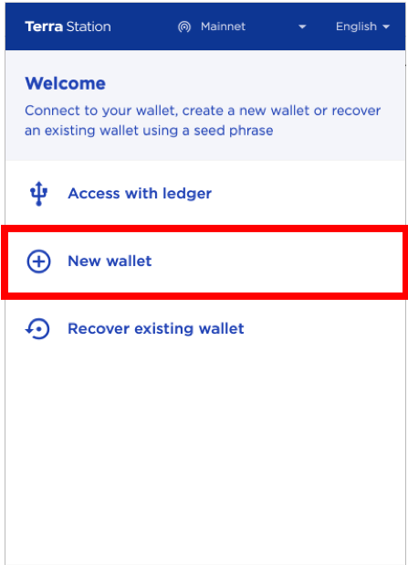
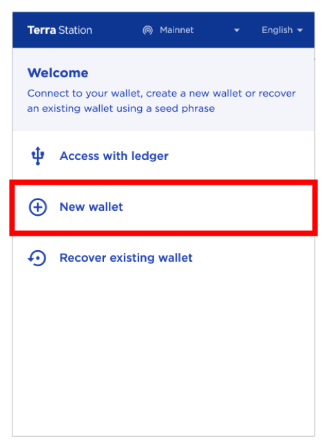
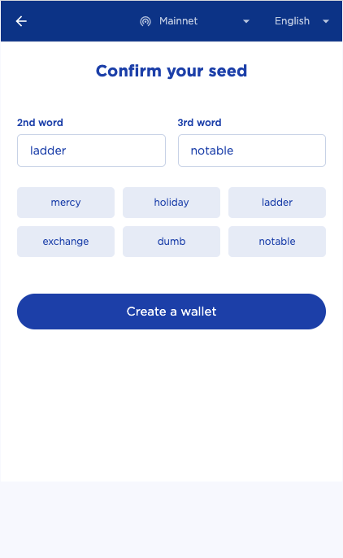
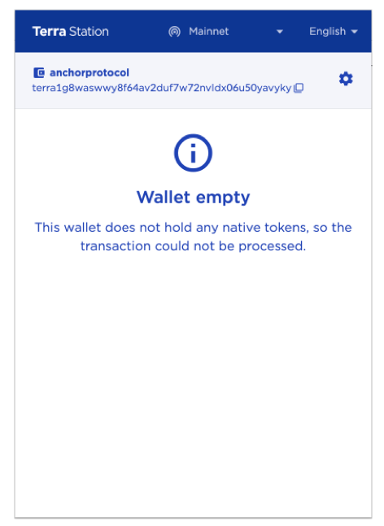
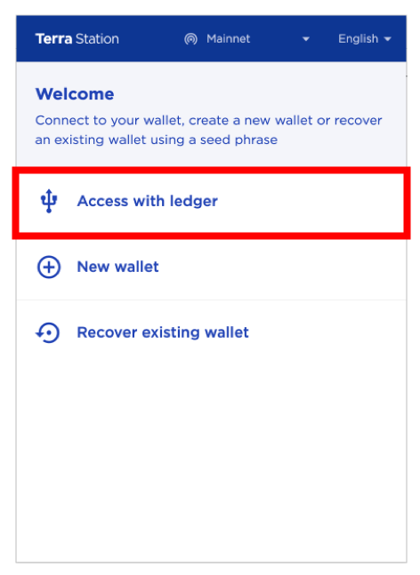
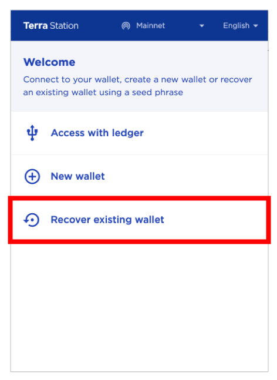
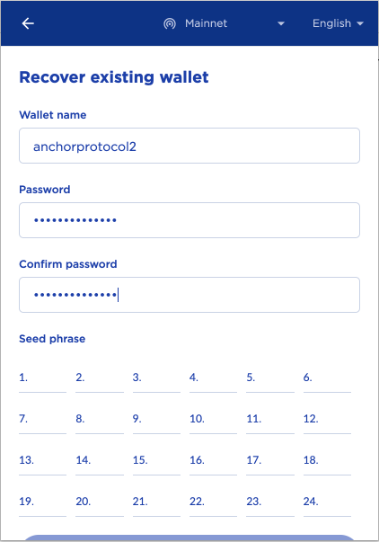

# WebApp

**The Cavern WebApp is the official web frontend for interacting with Cavern Protocol on the Terra network. The WebApp can be accessed at** [**https:\/\/cavernprotocol.com**](https://cavernprotocol.com)**.**

The **Cavern WebApp** offers a graphical user interface for accessing Cavern's core user operations, such as depositing & redeeming Axelar USDC, minting aAsset tokens, borrowing USDC with aAssets as collateral, and participating in Cavern governance.

::: {warning}
The Cavern web app requires [Google Chrome](https://www.google.com/chrome/) and [Station Extension](https://chrome.google.com/webstore/detail/terra-station/aiifbnbfobpmeekipheeijimdpnlpgpp) to be installed. Please follow the instructions below to set up your browser to be able to access the WebApp.
:::

## Terra Station Extension

::: {warning}
As of November 30th, 2022, Station Extension is only available for Chromium-based web browsers. The Firefox version is not compatible with Terra 2.0 yet.
:::

Station Extension is a Chrome extension that lets users interact with smart contract web frontends with an embedded in-browser wallet. When a user makes an interaction on Cavern WebApp, the WebApp will generate a transaction in the proper format that encodes the user's desired operation. Station Extension will detect and prompt the user to sign and broadcast the transaction to actually execute the operation.

### Installing Station Extension

1. Run [Google Chrome](https://www.google.com/chrome/). Station Extension is only available for Chromium-based web browsers.  &#x20;
2. Install Station Extension [here](https://chrome.google.com/webstore/detail/terra-station/aiifbnbfobpmeekipheeijimdpnlpgpp?hl=en).&#x20;
3. **Terra Station** should now be visible on the extensions tray.&#x20;

### Creating a new wallet

1\. Open **Station Extension**

2\. Select **New Wallet**



3\. Set a wallet name and password. **Make sure to record the created 24 word seed phrase in a secure storage**. Select **\[Next]** to proceed.



4\. Confirm the created seed phrase by inputting the correct words.



5\. Select **\[Create a wallet]** to finish.




### Accessing with the Ledger Hardware Wallet

Terra Station Extension allows users to connect and sign transactions with their Ledger Nano S or Nano X. To access Ledger from Station Extension, users should:&#x20;

* Install Terra application using [Ledger Live](https://www.ledger.com/ledger-live/download/) application. The Developer Mode on Ledger Live application from Settings > Experimental Features must be enabled to install Terra application.  

* The Ledger device must be connected to the user's computer via USB. Station Extension **does not support connecting with Bluetooth**.

To access Ledger from Terra Station Extension, the following steps are required:&#x20;

1\. Connect and unlock your Ledger device

2\. Open Terra application from Ledger

3\. Select **\[Access with ledger]** on Terra Station Extension menu



4\. Once Ledger has been successfully connected with Terra Station Extension, transactions can be signed with Ledger.


### Recovering an Existing Wallet

1\. Select **\[Recover existing wallet]**



2\. Enter a new wallet name and password.



3\. Enter the 24 word seed phrase of the wallet to recover and select **\[Next]** to finish.


## Obtaining axlUSDC 

Cavern's money market uses axlUSDC as their base denomination. Users must have a balance of axlUSDC before they can interact with Cavern.

There are several ways to obtain axlUSDC

* Swapping Luna for axlUSDC
* Migrating USDC from other Blockchains into Terra

### Swapping Luna for axlUSDC

Users can swap Luna or other tokens into axlUSDC using DEX on Terra. We recommend using [TFM DEX aggregator](https://tfm.com/terra2/trade/swap), to get you the best price and loose as less capital as possible in the swapping process. We recommend you follow [their nice tutorial](https://docs.tfm.com/products/dex-aggregator/token-swapping-guide).

### Migrating USDC from other Network into Terra

The preferred solution for depositing USDC into Terra is to use [Axelar's decentralized bridge](https://satellite.money/?destination_address=&asset_denom=uusdc&source=polygon&destination=terra). Their blockchain infrastructure allows you to transfer USDC from other blockchains (Ethereum or Polygon for instance) into Terra using decentralized mecanisms. If you are just onboarding Terra, we recommend going through Polygon that has less gas fees in order to use the bridge. 

We recommend following their [brilliant tutorial](https://satellite.money/), that you can access by clicking the **\[Getting Started]** button on top of the page. They also drafted a [video tutorial](https://www.youtube.com/watch?v=D7ooheNAvB0) for you to observe others bridge their assets seamlessly.


```{toctree}
:hidden:
earn
borrow
bond
```