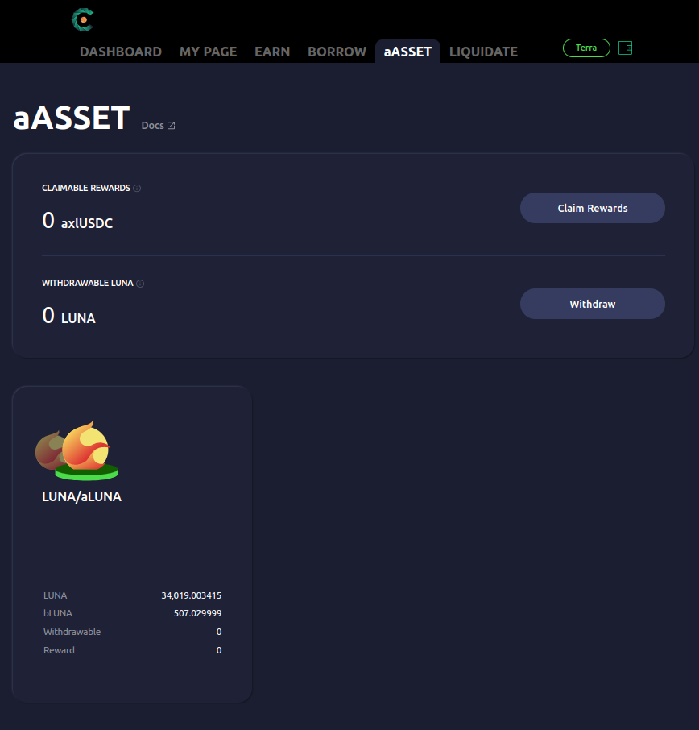
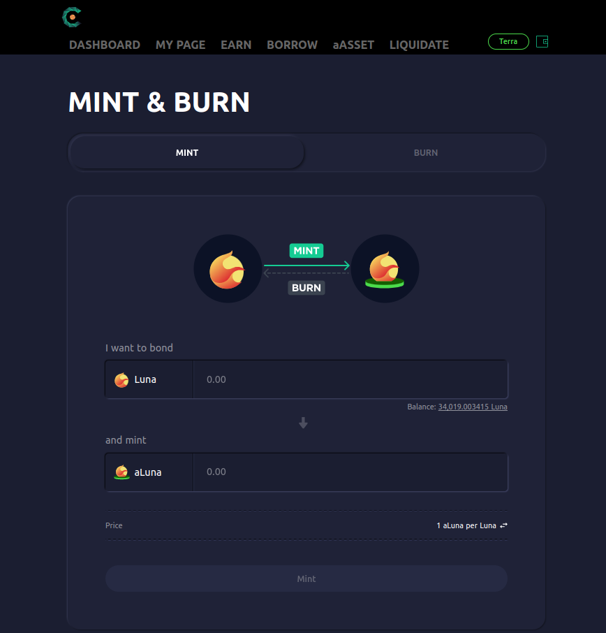
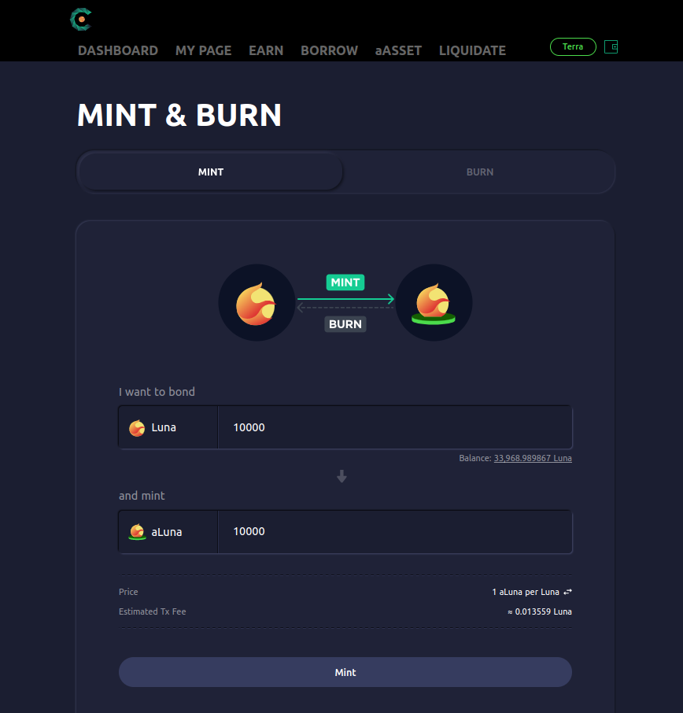
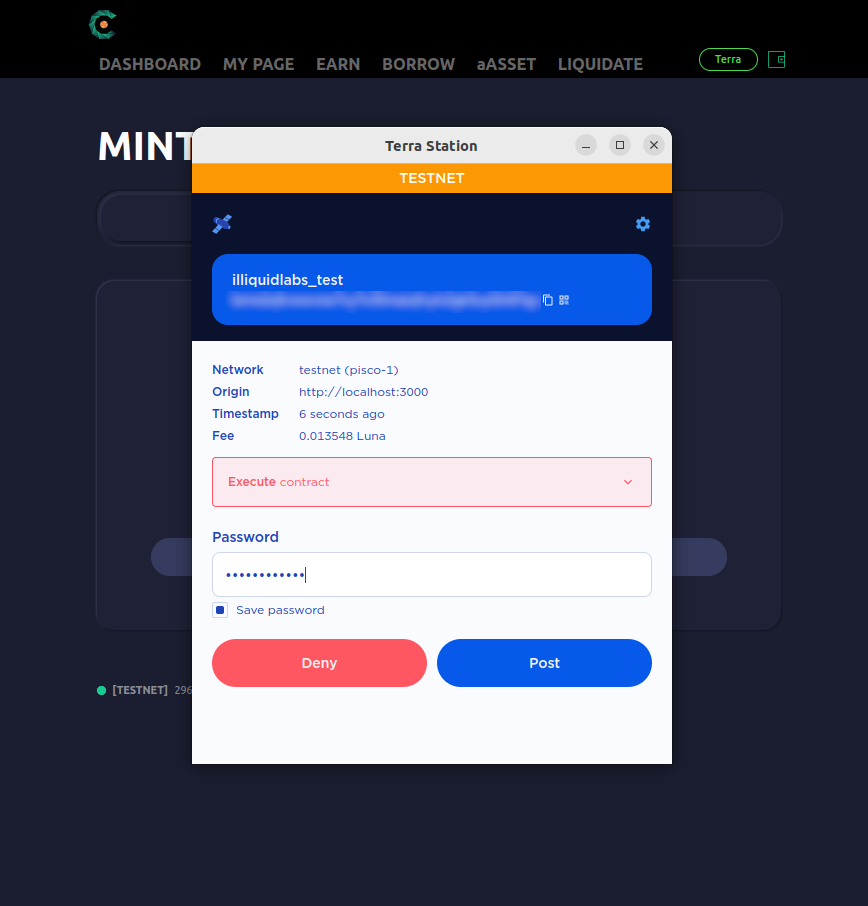
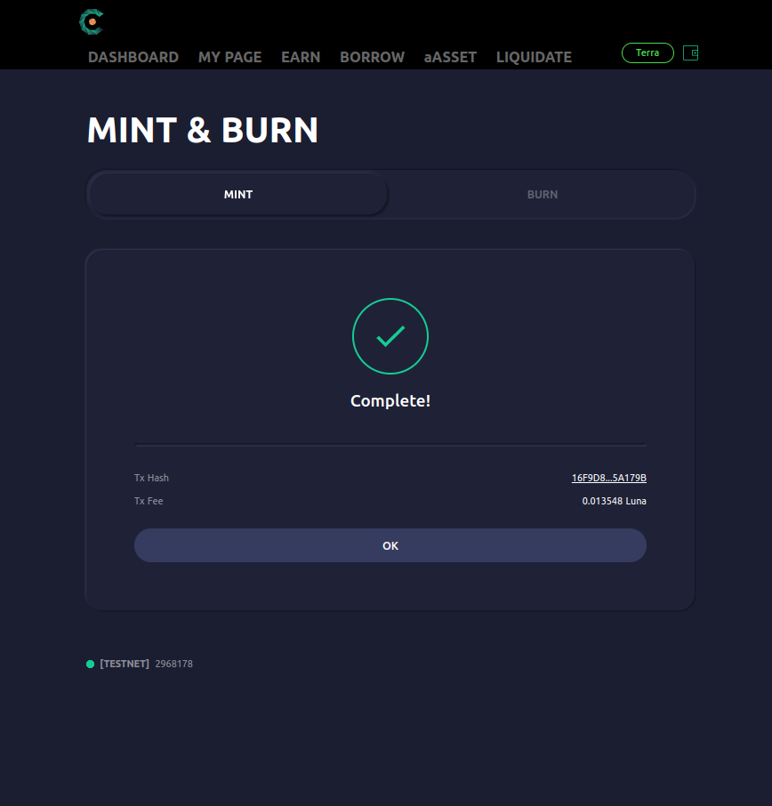
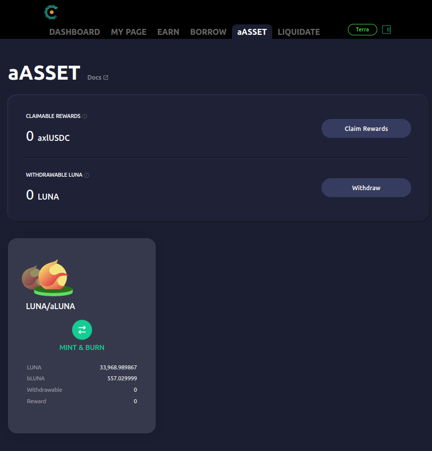
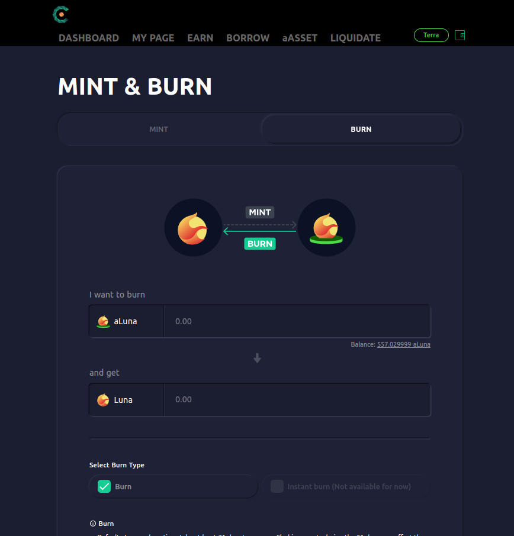
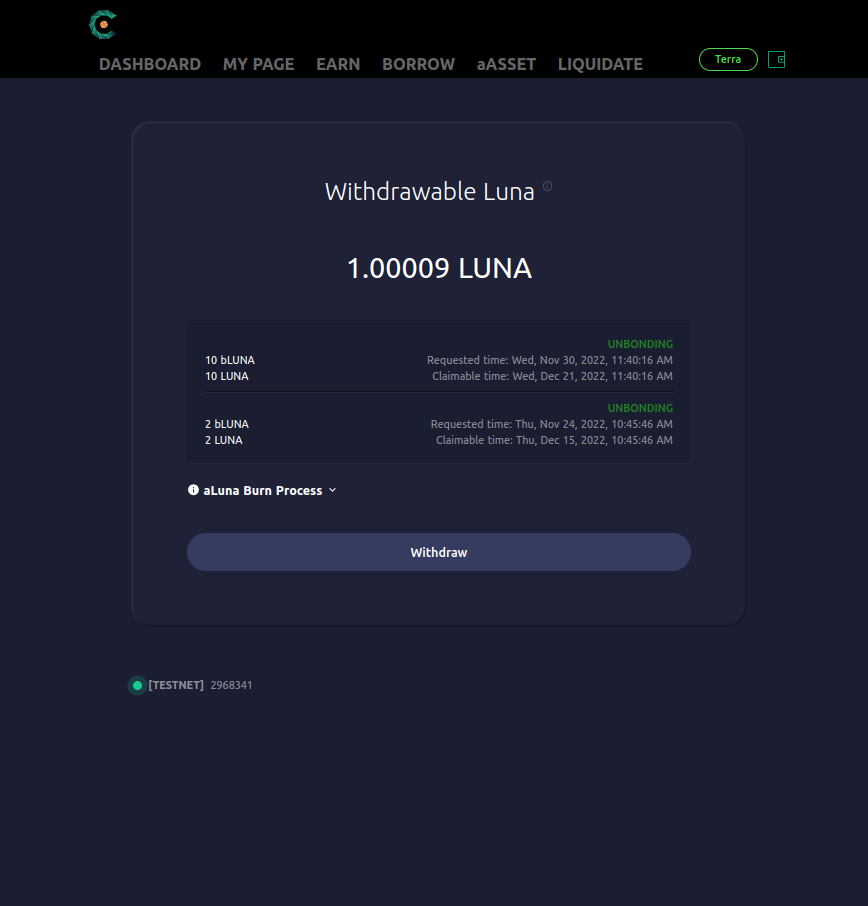
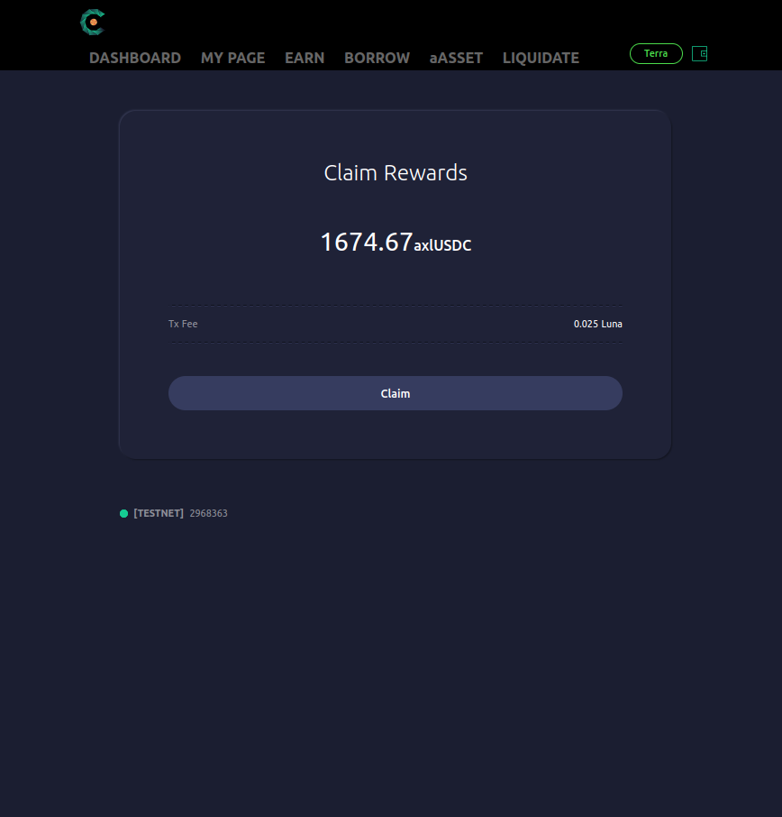

# aASSET \[aLUNA]

The **aASSET** page enables users to easily interact with aAsset tokens. Through this page, users can mint aAssets, burn aAsset to redeem the underlying Asset, and claim aAsset rewards.

## Minting aLuna

1\. Navigate to the **LUNA/aLUNA** page in the **aASSET** page.

2\. Navigate to the **MINT** tab.&#x20;

3\. Enter the amount of Luna to use in minting or the amount of aLuna to mint and click the **\[Mint]** button to confirm.

4\. Station Extension should prompt you to sign a transaction that contains the mint operation. Confirm the details presented and enter your password to sign.

5\. Mint complete.

## Burning aLUNA to redeem LUNA

1\. Navigate to the **LUNA/aLUNA** page in the **aASSET** page.

2\. Navigate to the **BURN** tab.&#x20;

3\. Select a burn method. **BURN** and **INSTANT BURN** each correspond to:

* **BURN**: Burn aLuna through the aLuna protocol and redeem Luna. Redeemed Luna can be withdrawn after the Terra blockchain's unbonding period. Redemption is done with the current aLuna exchange rate but requires at least 21 days and the redemption amount may be affected by validator slashing.

::: {warning}
Burn requests are processed in 3-day batches. Burn requests that are yet to be included in a batch are marked as **pending** in the **CLAIM** page.
:::

* **INSTANT BURN**: Swap aLuna for Luna through Astroport, an [Uniswap](https://uniswap.org)-like automated market marker (AMM) protocol on Terra. This process is instant but may suffer from trade slippage and Astroport commissions. This method is not available right now, as no pool exists yet on Astroport.

4\. The rest of the transaction is quite easy to follow, so we don't provide a detailed guide. Simply input the amount of aLuna to burn, click on the **\[Burn]** button and sign the transaction.

### Withdrawing Luna from burnt Luna

::: {note}
This subsection is only applicable for those that have burnt Luna through **BURN** and not **INSTANT BURN**.
:::

1\. Click the **Withdraw** button in the **WITHDRAWABLE LUNA** section.

2\. Check the amount of redeemed Luna available for withdrawal (**Withdrawable Luna**). Click the **\[Withdraw]** button to withdraw redeemed Luna.

3\. The rest of the transaction happens as usual, so we don't provide a detailed guide. 

## Claiming accrued aLuna rewards

::: {note}
aLuna rewards only accrue only if the user is currently holding aLuna tokens. Users do not accrue rewards from aLuna tokens deposited to Cavern.
:::

1\. Click the **Claim Rewards** button in the **CLAIMABLE REWARDS** section.

2\. Click the **\[Claim]** button to claim accrued rewards.

3\. The rest of the transaction happens as usual, so we don't provide a detailed guide. 
