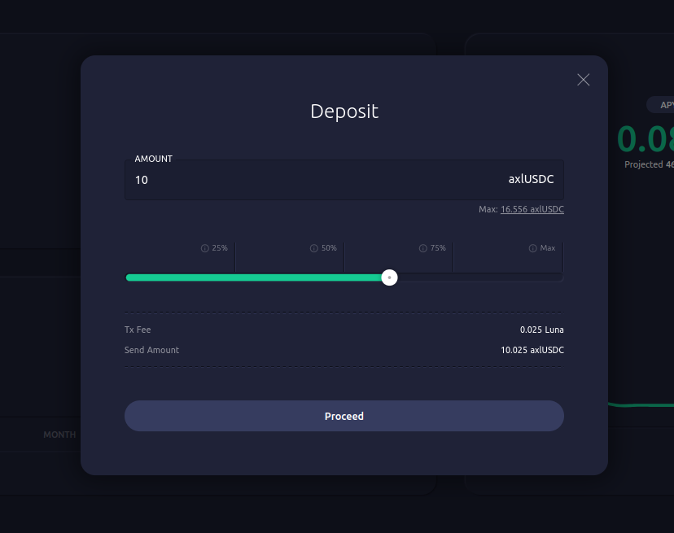
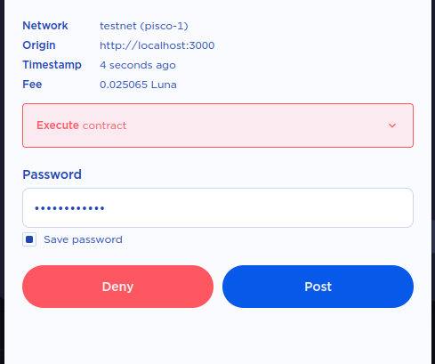
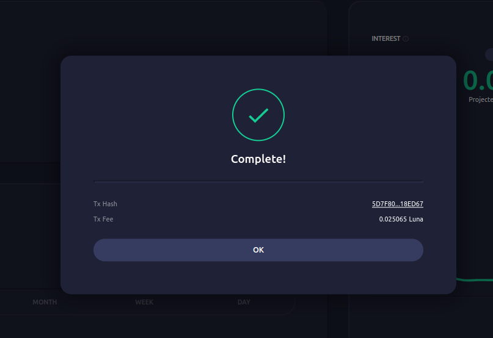
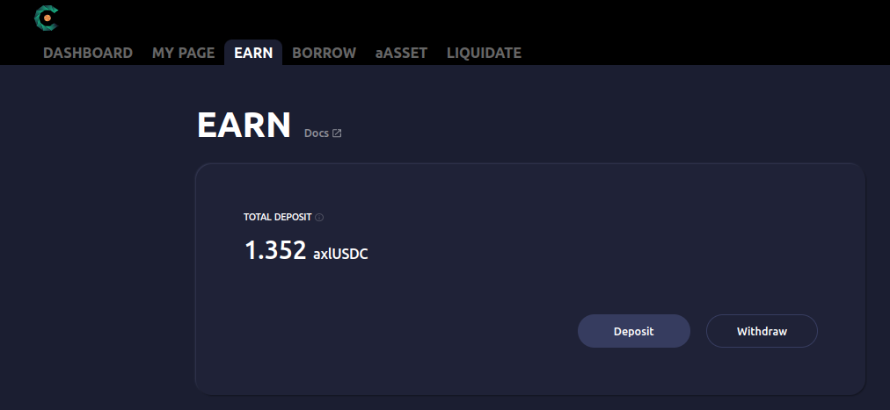
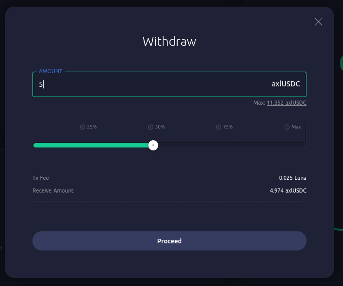
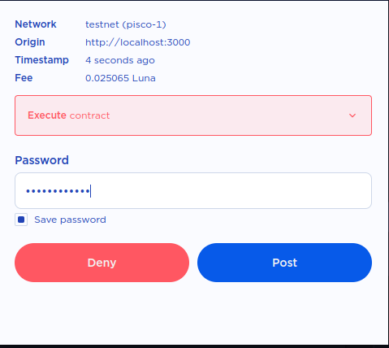
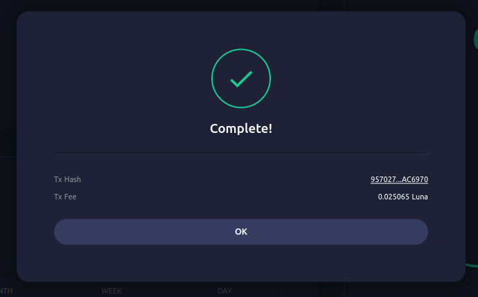

# EARN

The **EARN** page provides a savings account interface to earn Cavern yield on axlUSDC. It allows users to deposit and withdraw axlUSDC, track their current deposit value, history of transactions, current deposit annualized percentage rate (APY), and amount of interest earned from Cavern.

::: {note}
As of November 30th, 2022, Cavern only supports Axelar USDC (axlUSDC) as the base currency. Other stablecoins will be supported as adoption and pools grow on Terra.
:::

The **EARN** page displays the following data:

* **Total Deposit**: axlUSDC value of user's deposit. Includes accrued deposit interest.

* **Transaction History**: History of user's deposit & withdraw interactions. Displays the deposit / withdraw amount, sender / recipient, and transaction time.

* **Interest**: Display data related to deposit interest.
  * **APY**: Current deposit APY.
  * **APY Graph**: Historical graph of deposit APY.
  * **Interest Earned**: Amount of deposit interest earned during the selected time period.

## Depositing axlUSDC

1\. Navigate to the **EARN** page and click the **\[Deposit]** button.&#x20;

.png)

2\. Enter the amount of stablecoins to deposit and click the **\[Proceed]** button to confirm.

3\. Station Extension should prompt you to sign a transaction that contains the deposit operation. Confirm the details presented and enter your password to sign.

4\. Deposit complete.

## Withdrawing axlUSDC

1\. Navigate to the **EARN** page and click the **\[Withdraw]** button.&#x20;

2\. Enter the withdraw amount and click the **\[Proceed]** button to confirm.

3\. Station Extension should prompt you to sign a transaction that contains the withdraw operation. Confirm the details presented and enter your password to sign.

4\. Withdraw complete.

